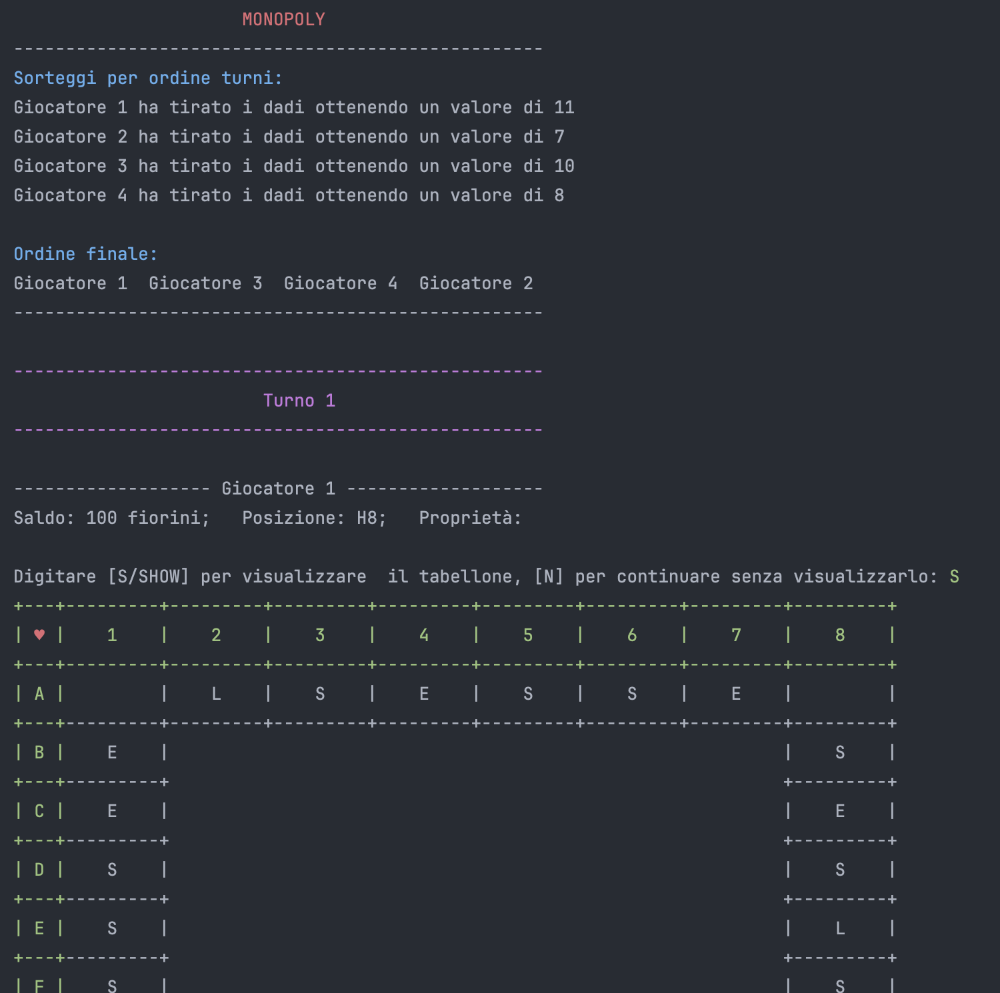
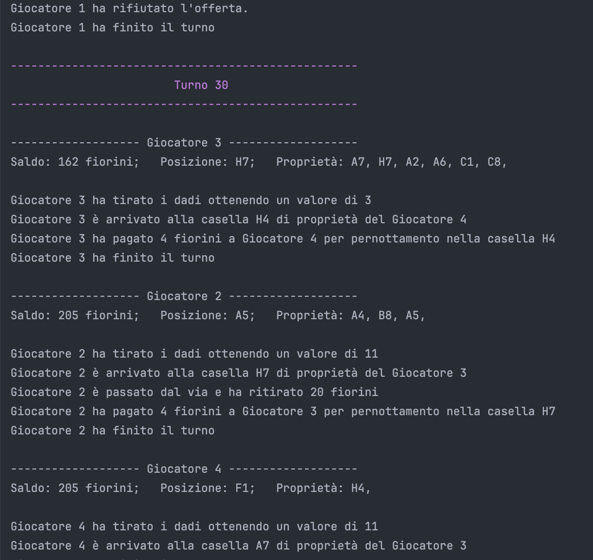
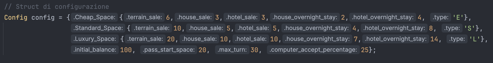

# Monopoly
Progetto finale Laboratorio di Programmazione\
[Github](https://github.com/Matteo-Trevisan/Monopoly)

## Descrizione del Progetto
Il progetto è un'implementazione semplificata del 
celebre gioco da tavolo Monopoly, sviluppato come test finale del 
corso di "Laboratorio di Programmazione" del secondo anno di Ingegneria Informatica.

## Membri del Gruppo
- Matteo Trevisan
- Elia Tolfo
- Andrea Sacchetto

## Struttura del Codice

[Project structure](Project_Structure_Canvas.png)

## Funzionalità Implementate
Nel progetto sono state implementate tutte le funzionalità richieste all'interno del file pdf contenente la 
[consegna](Direttive%20Progetto.pdf) dettagliata. Si tratta di funzionalità che riprendono i caratteri generali del gioco originale, ma su 
cui sono state apportate alcune modifiche o semplificazioni per la sua realizzazione.

Al fine di evitare che la partita si prolunghi per un periodo di tempo eccessivamente lungo, la partita può anche terminare 
al raggiungimento di un determinato numero di turni prefissato.

Il programma genera un file di log (log_file.txt) nella stessa cartella da cui viene eseguito.

## Screenshot

## Note sui prezzi

### Config come da direttive:

|                          | Economica | Standard | Lusso |
|--------------------------|-----------|----------|-------|
| Acquisto terreno         | 6         | 10       | 20    |
| Acquisto casa            | 3         | 5        | 10    |
| Miglioramento ad albergo | 3         | 5        | 10    |
| Pernottamento in casa    | 2         | 4        | 7     |
| Pernottamento in albergo | 4         | 8        | 14    |

| Variabile                                 | Valore |
|-------------------------------------------|--------|
| **Fiorini iniziali**                      | 100    |
| **Passaggio per il via**                  | 20     |
| **Numero turni massimo**                  | 30     |
| **Percentuale offerta positiva computer** | 25     |

`Config config = {{6,3,3,2,4, 'E'},
{10,5,5,4,8, 'S'},
{20,10,10,7,14, 'L'},
100, 20, 30, 25};`

Su 1000 partite simulate, giocate con un giocatore umano ipotetico che risponde "si" ad ogni offerta
(comprare, migliorare), i risultati sono stati i seguenti;
- 976 vittorie di un giocatore computer per numero fiorini
- 17 pareggi tra 2 giocatori computer
- 3 vittorie del giocatore umano

Con 20 turni massimi per partita:
- 958 vittorie di un giocatore computer per numero fiorini
- 41 pareggi tra 2 giocatori computer
- 1 pareggio tra 3 giocatori computer
- 0 vittorie o pareggi del giocatore umano

### Config sperimentale 1:

|                          | Economica | Standard | Lusso |
|--------------------------|-----------|----------|-------|
| Acquisto terreno         | 90        | 190      | 340   |
| Acquisto casa            | 60        | 100      | 150   |
| Miglioramento ad albergo | 60        | 100      | 150   |
| Pernottamento in casa    | 40        | 75       | 100   |
| Pernottamento in albergo | 135       | 175      | 250   |

| Variabile                                 | Valore |
|-------------------------------------------|--------|
| **Fiorini iniziali**                      | 1500   |
| **Passaggio per il via**                  | 200    |
| **Numero turni massimo**                  | 100    |
| **Percentuale offerta positiva computer** | 25     |

`Config config = {{90,60,60,40,135, 'E'},
{190,100,100,75,175, 'S'},
{340,150,150,100,250, 'L'},
1500, 200, 100, 25};`

Su 1000 partite simulate, giocate con un giocatore umano ipotetico che risponde "si" ad ogni offerta
(comprare, migliorare), i risultati sono stati i seguenti;
- 981 vittore del giocatore umano per numero di fiorini
- 19 vittore di uno dei computer per numero di fiorini
- 0 pareggi

Se riduciamo il numero massimo di turni a 20, si ha:
- 977 vittorie di un giocatore computer per numero fiorini
- 23 pareggi tra 2 giocatori computer
- 0 vittorie o pareggi del giocatore umano

Invece con max_turni = 100 e soldi_al_via = 100:
- 671 vittore del giocatore umano per numero di fiorini
- 223 vittoria del giocatore umano perché è rimasto l'ultimo giocatore
- 106 vittore di uno dei computer per numero di fiorini
- 0 pareggi

## Istruzioni alla compilazione
Il progetto è compilabile utilizzando CMake; per procedere con la compilazione, seguire le istruzioni di seguito:

`$ mkdir build`

`$ cd build`

`$ cmake ..`

`$ make`

Oppure usare lo script _build_project_linux.sh_ dedicato.
(Potrebbe essere necessario formire il permesso di esecuzione `$ sudo chmod +x build_project_linux.sh`)

## Esempi di Utilizzo

Il programma richiede un argomento passato da terminale che può essere:
- ./Monopoly computer
- ./Monopoly human

Per giocare rispettivamente una partita con 4 giocatori automatici (computer) oppure una 
partita in cui il primo giocatore è umano.

Inoltre per impostare i parametri di gioco tramite l'oggetto config dentro main.\
L'oggetto è strutturato in questo modo:

Config: { Cheap_Space: {_terrain_sale_, _house_sale_, _hotel_sale_, _house_overnight_stay_, _hotel_overnight_stay_, _type_},\
Standard_Space: {_terrain_sale_, _house_sale_, _hotel_sale_, _house_overnight_stay_, _hotel_overnight_stay_, _type_},\
Luxury_Space: {_terrain_sale_, _house_sale_, _hotel_sale_, _house_overnight_stay_, _hotel_overnight_stay_, _type_},\
_initial_balance_, _pass_start_space_, _max_turn_, _computer_accept_percentage_ }

Le variabili sono:
- **terrain_sale**: definisce il prezzo di vendita del terreno
- **house_sale**: definisce il prezzo per costruire una casa
- **hotel_sale**: definisce il prezzo per costruire un albergo
- **house_overnight_stay**: definisce il costo di pernottamento in una casella con una casa
- **hotel_overnight_stay**: definisce il costo di pernottamento in una casella con un albergo
- **type**: definisce una lettera che rappresenterà quel tipo di casella nel tabellone
- **initial_balance**: definisce il saldo iniziale di ciascun giocatore in fiorini (default: 100)
- **pass_start_space**: definisce la quantità di fiorini che viene data a ciascun giocatore ogni qual volta passa dal VIA (default: 20)
- **max_turn**: definisce il numero di turni massimo del gioco, oltre il quale verranno decretati dei vincitori in base alla liquidità dei giocatori (default: 30)
- **computer_accept_percentage**: definisce un numero da 0 a 100 che rappresenta la percentuale con cui i giocatori computer accetteranno un'offerta (default: 25)

## Test
Sono stati fatti dei test per rilevare memory leak utilizzando [Valgrind](https://valgrind.org/) e sono risultati tutti negativi.